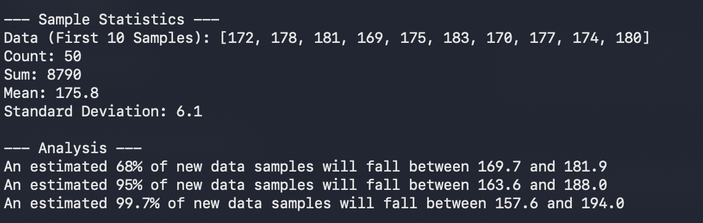

# Code Demo
The purpose of this repo is to showcase Blake Cromar's skills as a software developer. Generally, this will be used for job interviews. Currently, there is only one demo. In this demo the code calculates the standard deviation of an array of data.

## Table of Contents
- Contributing
- License

## How to Use

1. Navigate to the folder where the repo will be stored
```
cd /path/to/your/desired/folder
```

2. Clone the repo into the local directory you chose in the pervious step

```
git clone https://github.com/blake-cromar/code_demo.git
```

3. Open the folder of the project

```
cd code_demo
```

4. Run the script
```
python3 src/standard_deviation.py 
```

## Example Output




## File Structure
```
CODE_DEMO/                      | Main folder
├─ .gitignore                   | .gitignore file used to prevent types of files from being pushed to repo
├─ README.md                    | Used to provide an over view of this code
├─ output_example.png           | An example of the desired output
└─ src/                         | Contains the main source code
   └─ standard_deviation.py     | Contains the Python programming example
```
## Contributing
Blake Cromar, Software Engineer, blake.cromar@icloud.com

## License

Proprietary No-Use License

Copyright (c) 2025–present Blake Cromar. All rights reserved.

Grant of Rights

No rights, licenses, or permissions are granted to any person or entity to use, copy, modify, distribute, sublicense, sell, publish, host, transfer, display, perform, or otherwise exploit the Licensed Work or any portion of it for any purpose.

Definitions

Licensed Work means all source code, binaries, documentation, assets, and other materials contained in this repository.

Restrictions

•  The Licensed Work must not be reproduced, adapted, translated, compiled, shipped, uploaded, posted, publicly displayed, performed, or transmitted in any form or by any means without the Owner’s prior written permission.
•  The Licensed Work must not be used for private, commercial, academic, or research purposes.
•  No derivative works, forks, patches, or adaptations of the Licensed Work are permitted.
•  Third parties may not reverse engineer, decompile, disassemble, or otherwise attempt to derive the source of the Licensed Work.

Ownership

The Owner retains all right, title, and interest in and to the Licensed Work, including all intellectual property rights.

Termination

Any unauthorized use of the Licensed Work terminates any purported license or permission and may subject the user to legal action.

Warranty and Liability

THE LICENSED WORK IS PROVIDED “AS IS” WITHOUT WARRANTIES OF ANY KIND. THE OWNER DISCLAIMS ALL WARRANTIES, EXPRESS OR IMPLIED, INCLUDING MERCHANTABILITY, FITNESS FOR A PARTICULAR PURPOSE, AND NON-INFRINGEMENT.
IN NO EVENT WILL THE OWNER BE LIABLE FOR ANY DIRECT, INDIRECT, INCIDENTAL, SPECIAL, EXEMPLARY, OR CONSEQUENTIAL DAMAGES ARISING FROM THE USE OR INABILITY TO USE THE LICENSED WORK.

Permission Requests

Requests to obtain any usage rights, exceptions, or a separate license must be submitted in writing to: blake.cromar@icloud.com.